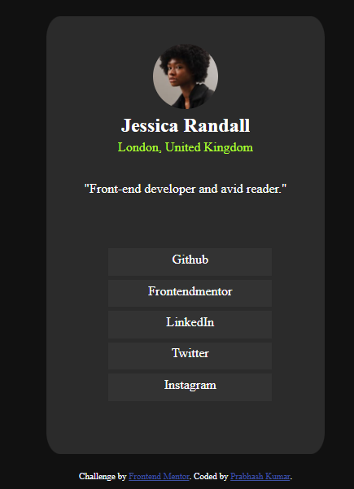
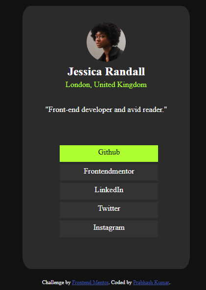

# Frontend Mentor - Social links profile solution

This is a solution to the [Social links profile challenge on Frontend Mentor](https://www.frontendmentor.io/challenges/social-links-profile-UG32l9m6dQ).

## Table of contents

- [Overview](#overview)
  - [The challenge](#the-challenge)
  - [Screenshot](#screenshot)
  - [Links](#links)
- [My process](#my-process)
  - [Built with](#built-with)
  - [What I learned](#what-i-learned)
  - [Useful resources](#useful-resources)
- [Author](#author)
- [Improvements](#Improvements to be done)


## Overview

### The challenge

Users should be able to:

- See hover and focus states for all interactive elements on the page

### Screenshot

 | 


### Links

- Solution URL: [Github Repo Link](https://github.com/Prabhashg/frontendmentor_social-links-profile-main)
- Live Site URL: [Click here to view'](https://project1prabhash.vercel.app/)

## My process
- I first created a div element to put everything inside it. I thought about putting two more div elements inside it, for the top and 
bottom segments, but then I ditched the idea and for desktop screen, it just worked fine.
- Then I created an image element, a heading element and two paragraph elements
- Then I created an unordered list and styled all the items accordingly.

### Built with

- Semantic HTML5 markup
- CSS custom properties


### What I learnt

I learnt how to add hovering effect by doing this challenge. Although it was an easy doing, but using it first time, I'm really feeling
like I've learnt something new.

```css
ul li:hover{
    background-color: greenyellow;
    color: black;
    cursor: pointer;
}
```

### Useful resources

- [Cursor to Pointer when hovering](https://stackoverflow.com/questions/3087975/how-to-change-the-cursor-into-a-hand-when-a-user-hovers-over-a-list-item) - This helped me changing the cursor into hand when hovering on the list item.


## Author

- LinkedIn - [Prabhash Kumar](https://www.linkedin.com/in/prabhash-kumar-405648201/)
- Frontend Mentor - [@Prabhashg](https://www.frontendmentor.io/profile/Prabhashg)
- Twitter - [@krprabhasw](https://www.twitter.com/krprabhasw)

## Improvements to be done

- The page is not responsive, it doesn't behave properly for small screen sizes. That I'll have to fix after learning about it.